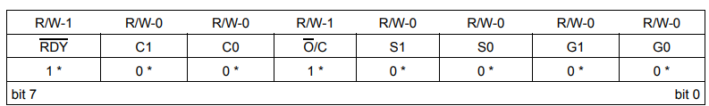
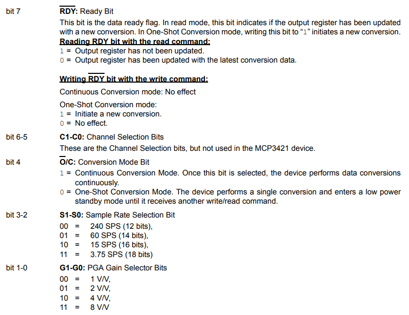

#АЦП

Пороговое напряжение обычно устанавливается на уровне 2.2В c допуском примерно +-5%. Если напряжение питания будет ниже, то устройство будет находиться в состоянии сброса.

Время задержки перед включением 300мкс

Внутренный конденсатор 3.2 пФ

Рабочее напряжение: 2.7-5.5 В

Рабочая температура: -40°C-125°C

Конфиг регистра:

Начиная с младшего бита, расположенного справа

Биты 1-0 коэф. усиления

Биты 3-2 за количество измерений в секунду или разрядность

Бит 4 отвечает за режим работы, непрерывный (все время измеряет) или по запросу (измерил и уснул)

Бит 5-6 не используется

Бит 7 закончилось ли изменение в режиме «one-shoot»

Способ передачи данных I2C:

| Кол-во бит | СколькоВ на 1 бит/коэф. усиления | измерений в сек | Min значение | Max значение |
|:----------:|:--------------------------------:|:---------------:|:------------:|:------------:|
| 12         | 1мВ                              | 240             | -2048        | 2047         |
| 14         | 250мкВ                           | 60              | -8192        | 8191         |
| 16         | 62.5мкВ                          | 15              | -32768       | 32767        |
| 18         | 15.625мкВ                        | 3.75            | -131072      | 131071       |

[АЦП](https://roboparts.ru/catalog/interfeysy_i_perekhodniki/tsap_i_atsp/gy-mcp3421/)