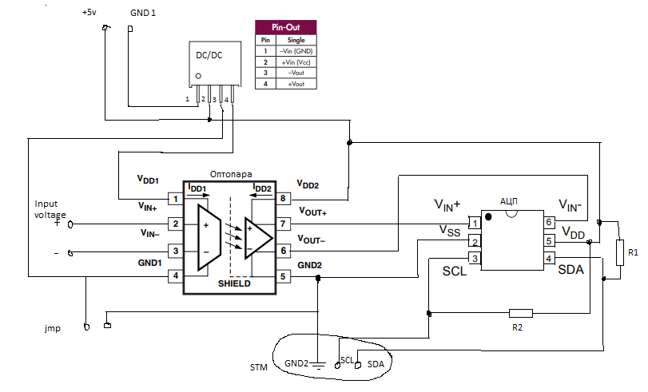

# Схема измерения тока

Схема состоит из трёх основных элементов: 

1) TME 0505S, DC/DC преобразователь ("DC/DC"); 

2) HCPL7840-000E, Оптопара усилитель с гальванической развязкой ("Оптопара");

3) АЦП I2C ("АЦП").

Два входных провода (+5V, GND1) приходят от преобразователя 24/5 (нет на схеме). 

Input voltage - напряжение, которое будем измерять.

jmp - джампер. Нужен для объединения/гальванической развязки земли (GND1 и GND2).

Провода GND2, SLC, SDA будут подключаться к STM.

Резисторы R1, R2 - подтягивающие резисторы. (Оставить место для них, но не припаивать)

Ссылки на необходимую документацию:

 [DC/DC преобразователь](https://static.chipdip.ru/lib/672/DOC011672083.pdf)

 [АЦП](https://roboparts.ru/upload/iblock/77a/77a9e151265a33f9e7cf682783691282.pdf)

 [Оптопара усилитель с гальванической развязкой](https://static.chipdip.ru/lib/007/DOC013007678.pdf)

