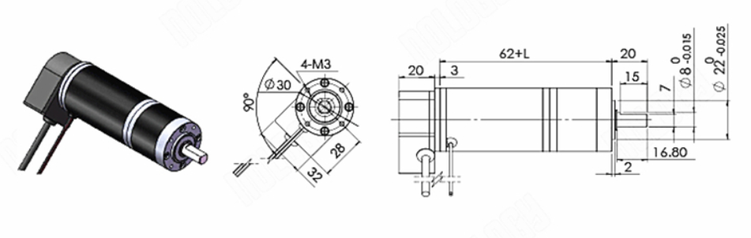

#36 мм планетарный мотор DC

Напряжение кодировщика составляет 5В. (Не использовать то же напряжение, что и двигатель)

Модель: 36GP-36ZYT

Модель двигателя: 2457

Номинальный коэффициент уменьшения: 5.18

Номинальная допустимая нагрузка редуктора: 20

Мгновенная допустимая нагрузка редуктора (зубчатое колесо – дословный перевод): 40

Номинальная выходная мощность 23 Вт:

- Нагрузка: 2.5
- Скорость : 869 об/мин

Скорость без нагрузки: 1100 об/мин

Длина редуктора: 32.5 мм

Контрольный вес машины: 0.37 кг

Номинальный ток: 1.6А

Ток заблокированного ротора: 5А

Номинальное напряжение: 24В

Энкодер двигателя:

Напряжение питания: постоянное напряжение 5В+-10%

Максимальная частота отклика: 60 кГЦ

Максимальная скорость вращения: 1000 об/мин

Рабочая температура: -20°C~85°C

Температура хранения: -20°C~85°C

Размеры, где L=длина редуктора.

[36 мм планетарный мотор DC](https://aliexpress.ru/item/1005002059136858.html?gatewayAdapt=glo2rus&sku_id=12000018591101863&spm=a2g0s.12269583.0.0.4de131575YREKu)