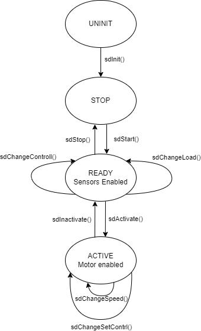

# Структура ПО нижнего уровня

Система может находиться в одном из четырёх состояний:

В состоянии UNINIT заполняется структура, в которой определяется первоначально подключенная нагрузка, а также желаемый регулятор.
  
При переходе в состояние LLD_READY исходя из нагрузки инициализируются нужные датчики. И запускается поток, отвечающий за их опрос. Тут же можно изменить подключенную нагрузку либо регулятор, выбранные в предыдущем состоянии. Изменение нагрузки повлечёт за собой переинициализацию датчиков. 
 
Далее при переходе в состояние LLD_ACTIVE происходит запуск двигателя. А также запуск потока регулятора (если он был выбран). Здесь можно менять скорость двигателя или внутренние настройки регулятора.

