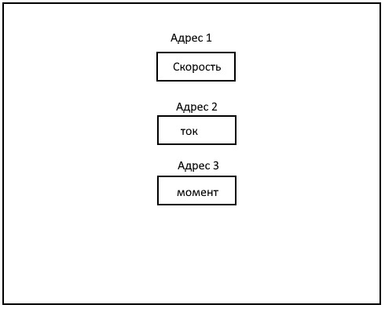
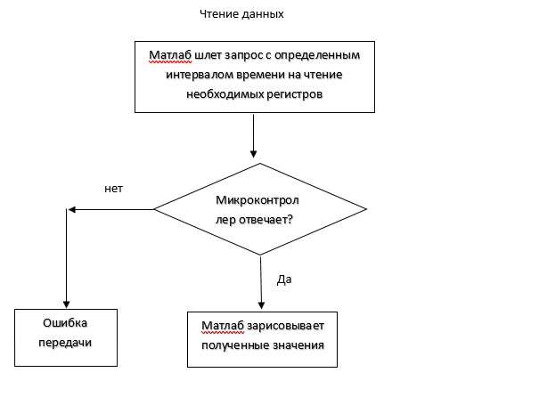
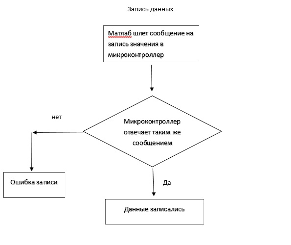
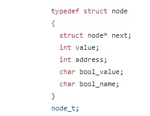

  

  
  

  
  
  Программа с пользовательским интерфейсом в матлаб (мастер) будет слать на микроконтроллер запросы на чтение регистров с адресами, например, 1, 2 и 3. Запрос будет содержать адрес устройства, номер команды, адрес первого регистра и количество регистров. Для определения типа запроса от мастера есть определенные команды.
  
  
  

  
  

  
  
  То есть мастер сможет записывать и читать регистры.
  
  
  

  
  

  
  
  
   

  
  

  
  
  Для чтения выбранных регистров матлаб будет слать запросы постоянно с выбранным интервалом времени. Если подчинённый не отвечает, то можно сделать выплывающее окно с ошибкой соединения.
  Для записи в регистр из матлаба будет отправляться соответствующее сообщение. Чтобы подтвердить запись можно из микроконтроллера отправить сообщение, подтверждающее запись.
  Для удобной работы с регистрами в микроконтроллере они будут созданы в виде структуры. 
  
  
  

  
  

  
  
  Структуры будет разделены на аналоговые и дискретные. Так у нас получится две таблицы. Их адреса можно сделать смещенные, чтобы не проверять какой это регистр, аналоговый или дискретный.
  Для подключения микроконтроллера к пк, необходим сетевой коммутатор.
  Для простого доступа к регистрам матбас будут созданы функции «гетеры».
  Например, для того чтобы получить значение скорости нужно вызвать функию:
  get_motor_speed();
  Для записи скорости:
  set_motor_speed();
  Передача данных через Modbus TCP будет довольно быстрой и обеспечит доставку покатов без искажения.
  Когда приходит данное на запись от GUI, срабатывает прерывание и исходя из полученной команды, можно понять что пришло.  
  IP адрес контроллера выставляется статическим и задается, номер порта постоянен: 502.
  Примеры по стеку LWIP
  https://www.mcu.by/lwip/

 

