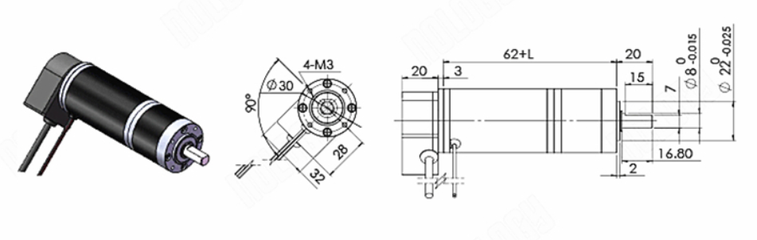
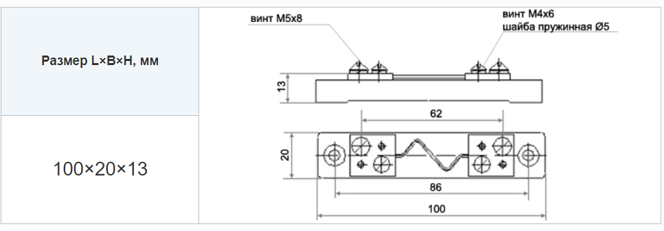
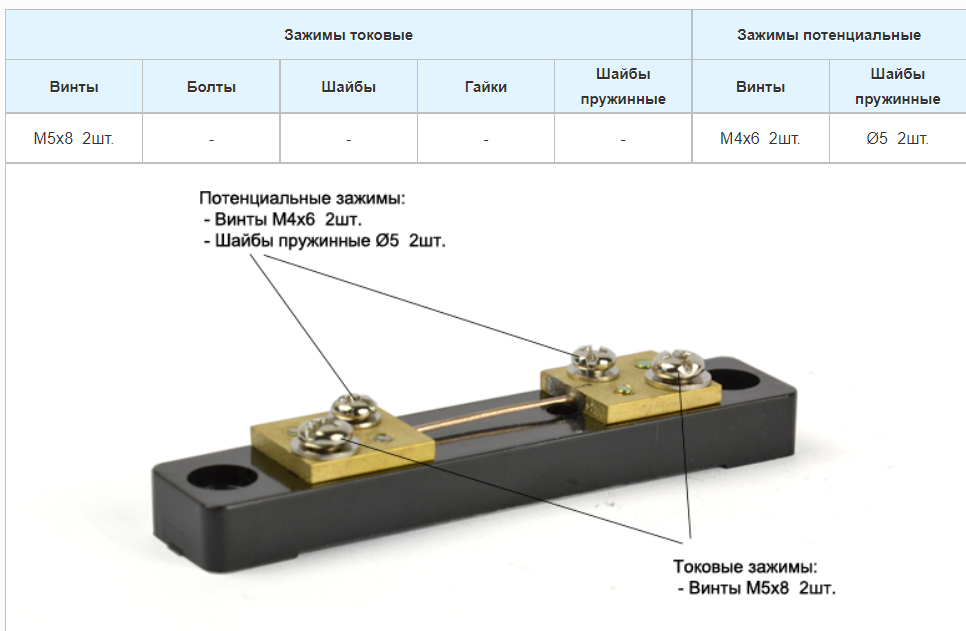
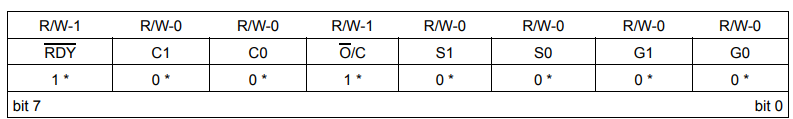
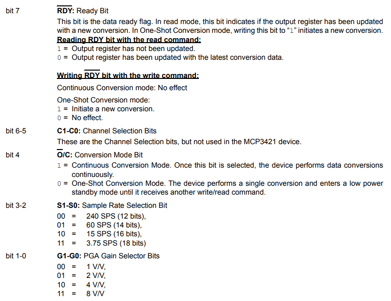

#36 мм планетарный мотор DC

Напряжение кодировщика составляет 5В. (Не использовать то же напряжение, что и двигатель)

Модель: 36GP-36ZYT

Модель двигателя: 2457

Номинальный коэффициент уменьшения: 5.18

Номинальная допустимая нагрузка редуктора: 20

Мгновенная допустимая нагрузка редуктора (зубчатое колесо – дословный перевод): 40

Номинальная выходная мощность 23 Вт:

- Нагрузка: 2.5
- Скорость : 869 об/мин

Скорость без нагрузки: 1100 об/мин

Длина редуктора: 32.5 мм

Контрольный вес машины: 0.37 кг

Номинальный ток: 1.6А

Ток заблокированного ротора: 5А

Номинальное напряжение: 24В

Энкодер двигателя:

Напряжение питания: постоянное напряжение 5В+-10%

Максимальная частота отклика: 60 кГЦ

Максимальная скорость вращения: 1000 об/мин

Рабочая температура: -20°C~85°C

Температура хранения: -20°C~85°C

Размеры, где L=длина редуктора.

#Энкодер

Модель: 6mm 5V 10bit CAN

Тип выхода: боковой выход.

10 бит = 1024P/R

Размеры:

#ШУНТ 5А 75mv

Размеры:

#Источник питания AM1D-0505SZ

Источник питания: AIMTEC

Выходное напряжение: 5В

Выходной ток: 0.2А

Диапазон рабочих температур: -40°C ~ 85°C

Количество выходов: 1

Корпус: SIP7

КПД: 81%

Масса: 2.3 г

Мощность: 1Вт

частота преобразования: 80 кГц

Напряжение Изоляции: 1000 VDC

Напряжение питания: 4.5В-5.5В

Размеры: 19.5mm x 6mm x 10mm (подправим)

#АЦП

Пороговое напряжение обычно устанавливается на уровне 2.2В c допуском примерно +-5%. Если напряжение питания будет ниже, то устройство будет находиться в состоянии сброса.

Время задержки перед включением 300мкс

Внутренный конденсатор 3.2 пФ

Рабочее напряжение: 2.7-5.5 В

Рабочая температура: -40°C-125°C

Конфиг регистра:

Начиная с младшего бита, расположенного справа

Биты 1-0 коэф. усиления

Биты 3-2 за количество измерений в секунду или разрядность

Бит 4 отвечает за режим работы, непрерывный (все время измеряет) или по запросу (измерил и уснул)

Бит 5-6 не используется

Бит 7 закончилось ли изменение в режиме «one-shoot»

Способ передачи данных I2C:

| Кол-во бит | СколькоВ на 1 бит/коэф. усиления | измерений в сек | Min значение | Max значение |
| ------ | ------ |
| 12 | 1мВ | 240 | -2048 | 2047 |
| 14 | 250мкВ | 60 | -8192 | 8191 |
| 16 | 62.5мкВ | 15 | -32768 | 32767 |
| 18 | 15.625мкВ | 3.75 | -131072 | 131071 |