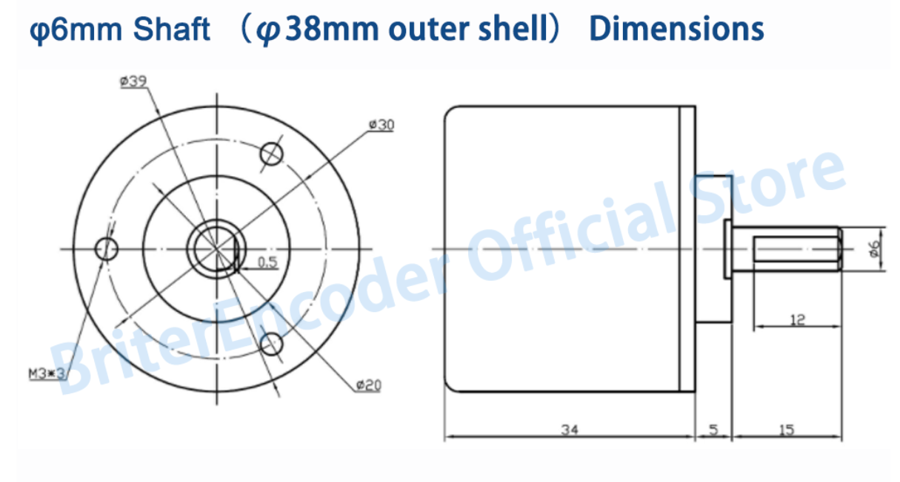

#Энкодер

Модель: 6mm 5V 10bit CAN

Тип выхода: боковой выход.

10 бит = 1024P/R

Размеры:

[Энкодер](https://aliexpress.ru/item/4001309275150.html?gatewayAdapt=glo2rus&sku_id=10000015687603201&spm=a2g0s.12269583.0.0.609b1e84TvdLx1)