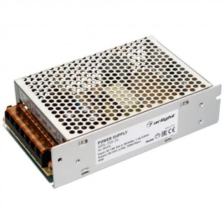

#Блок питания ARS-150-24 (24V, 6.25A, 150W)

Размеры: 160x98x42 мм

Питание: 

- Вход : "L" - фаза, "N" - ноль

- Выход: "V+", "Com", что означает "V-"

Документация прилагается на сайте

[Блок питания](https://www.arlight-russia.ru/arlight/bloki-pitaniya/24v/blok-pitaniya-ars-150-24-24v-6-25a-150w)

