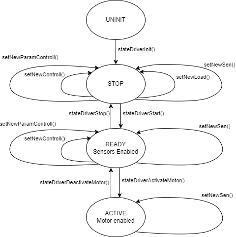

# Структура ПО нижнего уровня

В основном вся программа на микроконтроллере состоит из двух главных модулей: 

- модуль протокола Modbus
- модуль диспетчера

Modbus позволяет передавать информацию от пользователя в МК и обратно. 
Диспетчер при помощи mailbox общается с модулем Modbus и разбирает приходящую информацию, решая, что делать дальше.
И определяется это следующим образом. По mailbox диспетчер получает запрос в виде адреса ячейки Modbus и данных, которые требуются туда записать. В файле scheduler.c прописан switch-case по адресу ячеек, исходя из которых выполняются те или иные действия с записываемыми данными:  

```c
switch (address) {
      case SYSTEM_STOP:
	 ...
         break;

      case MEASURE:
	 ...
        break;
	}
	...
}
```

При этом диспетчер может переводить систему только в одно из четырёх состояний, в которых запускаются модули датчиков и регуляторов:


<p align="center">

</p>


В состоянии STOP происходит выбор подключенной нагрузки, регулятора и его настроек. Тут же можно отменить включение каких-то определённых датчиков. 
  
При переходе в состояние READY  запускается поток, отвечающий за включение/выключение датчиков. Тут же можно изменить регулятор(и настройки), выбранный в предыдущем состоянии, и включит/выключить какие-то датчики
 
Далее при переходе в состояние ACTIVE происходит запуск двигателя. А также запуск потока регулятора (если он был выбран). Здесь можно менять скорость двигателя.


 Требования для модулей с датчиками:
 1)  Функции:
 
     msg_t senInit(void); (инициализирующая ф-ция должна вернуть MSG_OK при успешном включении либо MSG_RESET ) 
     
     msg_t senUninit(void);(останавливающая ф-ция должна вернуть MSG_OK при успешном выключении либо MSG_RESET ) 
     
  2)  В самих модулях использовать define записи (см. [сюда](https://github.com/lsd-maddrive/Awesome_TAU_Stand/tree/5-LLD/docs/Modbus_register/README.md)) 
      и  define записи статуса датчика. Статус может быть:
      
	typedef enum {
	  SEN_NO_ERROR = 0,
	  SEN_BUS_ERROR = 1,
	  SEN_TIMEOUT =2,
	}senstatus_t;


Требования для модулей с регуляторами:  
  1) Функции:

     msg_t contrInit(void *arg);
  В качестве arg может передаваться некий параметр, который нужен для управления двигателем. Например, в подчинённом управлении arg - маска переменных состояния, по которым происходит регулирование.
 
      msg_t controlUninit(void);

  2) В модулях использовать define записи и чтения нужных данных из регистров Modbus  
  
